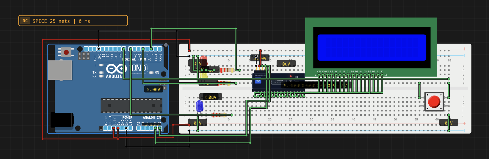

# Reaction Time Game

> Built in [Breadboard](https://breadboard.hackclub.com), a Hack Club program. This project took ~6 hours of work.

## What It Does

A game where it tests your reaction time

## How It Works

The circuit is captured in `breadboard-project.json`, and the firmware that runs it is in the `firmware/` folder.

## How To Use It

How to play the Reaction Time Game.

Components to pay attention to:

LED's: 
 - Blue will light up when game is running.
 - Red will light up when you should not click
 - Yellow will light up when you should click

LCD:
 - Gives instructions and reaction time

Button:
 - This is what users must use to play the game
 - Can be used to play again when LCD says so.

You must click the button to start the game. When you see 'Get Ready' on the LCD, or the red led is lit up, then get ready, since the yellow led will light up any time and you must click.

When the yellow led lights up, or the LCD says 'Click!', then click, and then you will get your reaction time.

You can then click the button to play again.

If you click too early, or too late, then you can click the button to play again.

## Demo

- **Simulate it live:** [https://breadboard.hackclub.com/share/105](https://breadboard.hackclub.com/share/105), runs the firmware in the Breadboard simulator
- **View the design:** [https://taniwankenobi.github.io/breadboard-plays/p/105/](https://taniwankenobi.github.io/breadboard-plays/p/105/)

## Schematic

The editor snapshot is in `breadboard-project.json`.

## Bill of Materials

| Part | Quantity |
| --- | --- |
| breadboard-full | 1 |
| lcd1602 | 1 |
| lcd1602-i2c | 1 |
| led-blue | 1 |
| led-red | 1 |
| led-yellow | 1 |
| pushbutton | 1 |
| resistor-220 | 3 |

## Firmware

Firmware files are in the `firmware/` folder.

## Build Journal

Build journal entries are kept in [`journals.md`](journals.md).

---

*Made in [Breadboard](https://breadboard.hackclub.com) — 6h of work*

